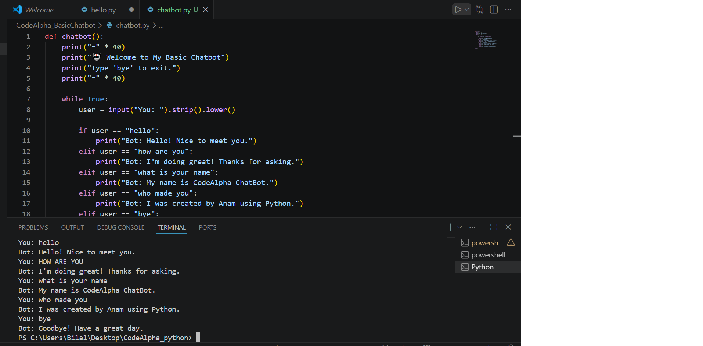

# Basic Chatbot

## Project Description
This is a simple rule-based chatbot developed in Python as part of the CodeAlpha Python Internship.

## Features
- Responds to "hello"
- Responds to "how are you"
- Tells its name
- Tells who created it
- Exits when the user types "bye"
- Handles unknown inputs

## Technologies Used
- Python 3
- VS Code
- Git
- GitHub

## How to Run
1. Open the project in VS Code.
2. Open the terminal.
3. Run:
   python chatbot.py
4. Start chatting with the bot.
5. Type "bye" to exit.

## Project Screenshot

## Author
Anam Mirza