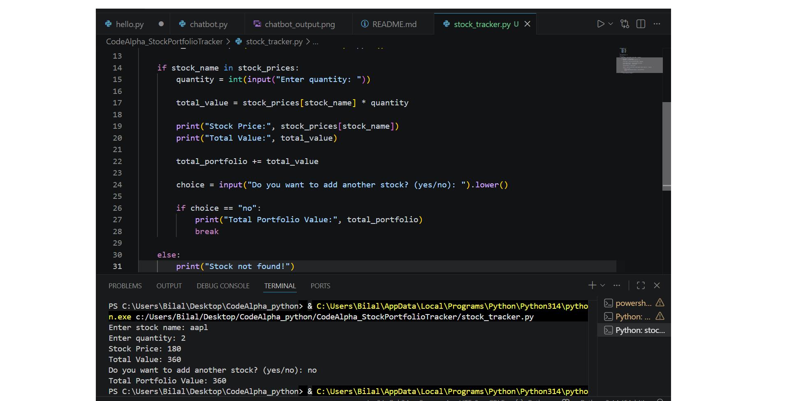
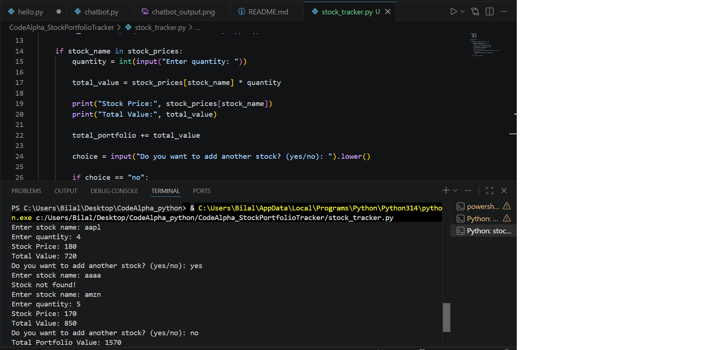

# 📈 Stock Portfolio Tracker

## 📌 Description
A simple Python application that calculates the total value of a stock portfolio based on user-selected stock names and quantities.

## ✨ Features
- Enter stock name and quantity
- Calculates individual stock value
- Tracks multiple stocks
- Displays total portfolio value
- Handles invalid stock names
- Accepts both uppercase and lowercase stock names

## 🛠️ Technologies Used
- Python 3

## ▶️ How to Run

1. Open the project in VS Code.
2. Open the terminal.
3. Run:

```bash
python stock_tracker.py
```

## 📷 Project Screenshots





## 👩‍💻 Author

**Anam Mirza**