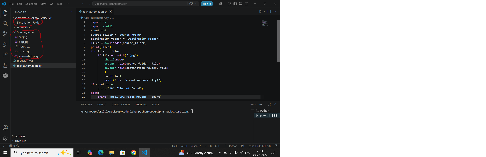
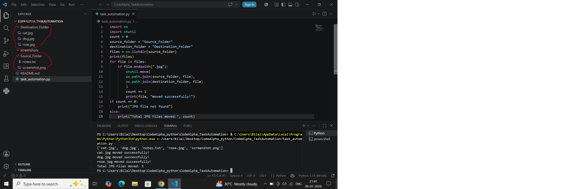

# 📂 Task Automation with Python Scripts

## 📌 Description
A simple Python automation script that moves all `.jpg` files from a source folder to a destination folder while leaving other file types unchanged.

## ✨ Features
- Reads all files from a source folder
- Moves only `.jpg` files
- Ignores other file types like `.txt` and `.png`
- Displays each moved file
- Counts the total number of JPG files moved
- Displays a message if no JPG files are found

## 🛠️ Technologies Used
- Python 3
- os module
- shutil module

## ▶️ How to Run

1. Open the project in VS Code.
2. Open the terminal.
3. Run:

```bash
python task_automation.py
```

## 📷 Project Screenshots

### Before Running


### After Running


## 👩‍💻 Author

**Anam Mirza**